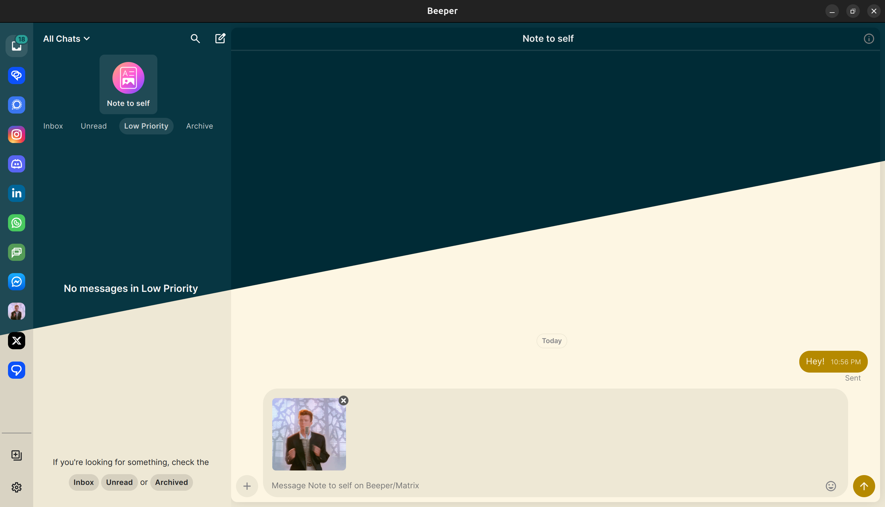

# Solarized for Beeper

_A Solarized color theme for Beeper._

Supports both light and dark mode.

## Installation

1. Copy `custom.css`
2. Open Beeper
3. Go to `Settings` > `Appearance` > `Open CSS file in editor`
4. Paste the contents of `custom.css` into the editor
5. Save the file
6. Click `Reload CSS`
7. Enjoy!

## License

This work is licensed under the MIT License. See [LICENSE](LICENSE) for more information.

## Contributing & Issues

Please feel free to open an issue or submit a pull request if you have any suggestions or improvements.
Make sure to include screenshots (before, after) and a detailed description of the issue or feature request.

## Credits

- [josselinonduty](https://github.com/josselinonduty/)
